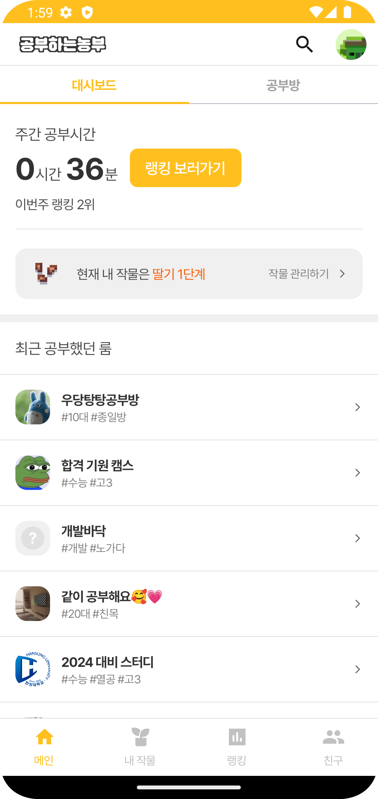
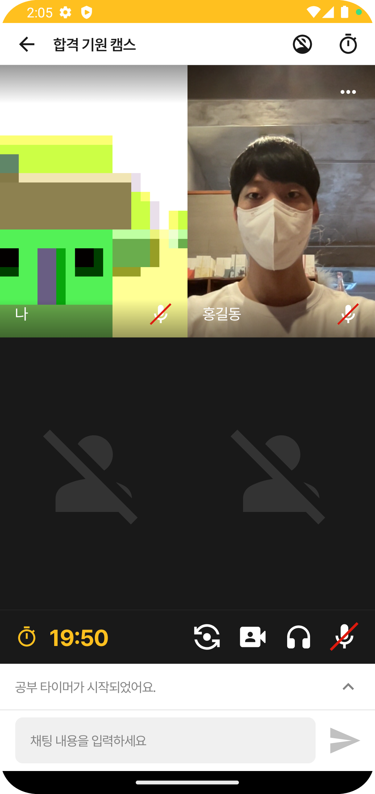
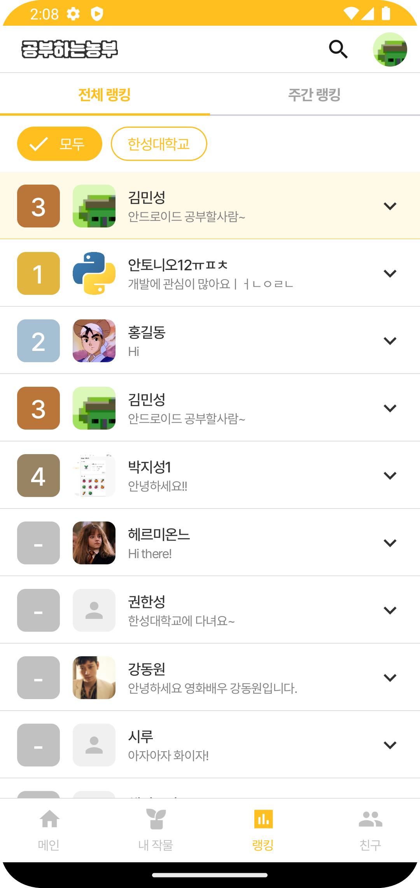

# camstudy-android

캠 스터디 서비스인 "공부하는 농부"의 안드로이드 앱입니다. 안드로이드 기기에서 공부방 접속, 랭킹 확인, 작물 심기 등의 기능을 지원합니다.
추후에 안정적으로 공부방 PIP를 지원하는 것이 목표입니다.

공부방에서는 [미디어 서버](https://github.com/Foundy-LLC/camstudy-webrtc-server)를 통해 상대방과 미디어 통신을 합니다.
WebRTC 라이브러리인 mediasoup을 이용하여 공부방 기능을 개발했습니다.
Mesh 구조의 경우 피어가 3명 이상이 되면 클라이언트의 부하가 심해지기 때문에 P2P로 개발하지 않고 SFU 방식으로 개발했습니다.

# 셋업

- Firebase에서 `google-services.json` 파일을 받아 앱 모듈에 놓는다.
- Firebase에 SHA 키를 등록한다.
- `local.properties`에 각종 비밀 값들을 설정한다.
- 빌드 후 실행

# 아키텍처

크게 `:app`, `:core`, `:feature` 모듈로 나누어져 있습니다.
각 `:feature` 모듈 내부에는 `:ui`, `:data` 모듈이 존재하며, 필요한 경우 `:domain` 모듈을 분리했습니다.

# 기술

- Dagger, Hilt
- Orbit(MVI)
- Retrofit2, OkHttp3
- Mediasoup, Socket.io
- Coil
- Compose, Compose Destinations
- Paging3
- JUnit4

# 스크린샷

| 홈                                         | 공부방                             |
|-------------------------------------------|---------------------------------|
|  |  |

| 랭킹                                    | 작물                              | 
|---------------------------------------|---------------------------------|
|  |  |
